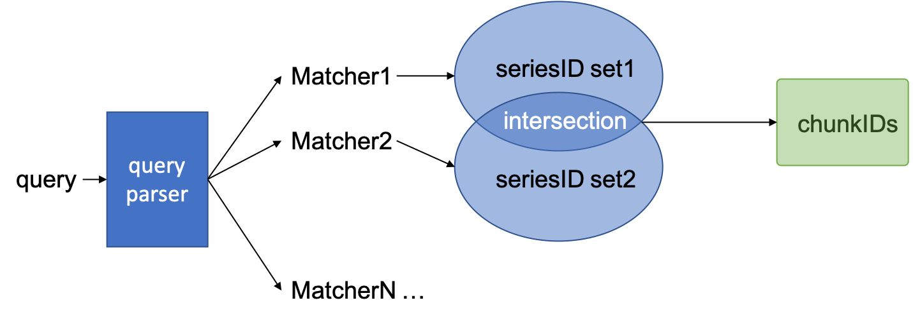

# Query

## Overview

### 索引结构

查询依赖索引。Loki 的索引结构见前文：[Loki storage format](./loki-storage-format.md#kv-store)

索引存在 KV-store 中。Loki 对于 KV-store 能力的假设非常简单：

- 只能根据 primary key 查询；
- primary key 能做等值比较 (`==`)；
- primary key 是有序的，可以进行 `>` `<` 判断。

所以，在 key 的设计上，会把 key 拆成 HashValue 和 RangeValue 两部分 (设计上，与使用 HBase 的玩法比较类似)。通常，有两种查询的 pattern：

```go
// Have some way to combine the two parts.
// The combination logic differs per KV store implementation.
key := encodeKey(hashValue, rangeValue)

// 1. Equals query
entries := db.Query(key)

// 2. Range query
c := db.Cursor()
c.Seek(key)
while c.HasNext() {
  entry := c.Next()
  // Filter entry in application
}
```

### 查询语法

Loki 使用自家的 LogQL 查询：https://github.com/grafana/loki/blob/master/docs/logql.md

查询语句中，可以包含 log stream selector，filter expression (和 Operator)。

#### log stream selector

log stream selector 可以筛选 stream，形式为：

```
{filename="/var/log/out1.log", job="varlog"}
```

代表的语义是:

```
(labelName="filename" AND matchType="MatchEqual" AND labelValue="/var/log/out1.log")
INTERSECT
(labelName="job" AND matchType="MatchEqual" AND labelValue="varlog")
```

除了等值比较 (MatchEqual) 以外，还有其他三种比较方式：

- `!=`: not equal.
- `=~`: regex matches.
- `!~`: regex does not match.

查询流程如下图所示，首先，用户提交的 query 会经过 parser 解析。解析后，log stream selector 的部分会被拆解成一个或多个 Matcher。每一个 Matcher，是一个 {Name, Type, Value} 的三元组。依次将每一个 Matcher 提交到 KV store 查询，可以得到一个对应的 seriesID 集合。把全部 seriesID 两两求交集，最终得到的结果，就是符合全部 Matcher 的 seriesID 集合。再次查询 KV store，将 seriesID 转换成 chunkID。

有了 chunkID 以后，就可以从 Object Store 中找到日志数据。



不管查询类型是什么，在实现中，求 seriesID set 的查询都只会走 **metricName:labelName -> hash(value):seriesID** ([View](./loki-storage-format.md#metricnamelabelname---hashvalueseriesid)) 这一种索引。

对于等值比较，最终的查询语句类似 (此处以 Cassandra 为例，其他的实现中有太多无关的细节)：

```sql
SELECT range, value FROM %s WHERE hash = ? AND range >= ? AND value = ?
```

从返回的 range 字段中，可以 parse 出 seriesID。

对于其他 Type 的比较，查询语句类似：

```sql
SELECT range, value FROM %s WHERE hash = ?
```

然后由 querier 自己 filter 结果。

当有了 seriesID 以后，根据索引 **seriesID -> chunkID** ([View](./loki-storage-format.md#seriesid---chunkid)) 可以得出 chunkID。

这里还有两个细节：

- 有的 Matcher 会匹配大量的结果，比如 `job=!"varlog"`。Loki 中使用了一种优化方案，通过比较 `Matcher.Matches("")` 结果是否为 true，把全部 Matcher 分成 filter 和 matcher 两类。先由 matcher 走正常逻辑生成 seriesID set，再把 filter apply 到这个集合上，过滤出最终结果。以此，来减少需要从 KV store 中查询的数据量。

- 在判定查询的 startTime / endTime 时，从 KV-store 中查询出的 chunkID 只能确保在 天(day) 的维度符合查询范围，没法精确到秒。需要 decode chunkID，取得 From，Though 两个字段来进一步过滤结果。

  例如：我想要查询 April 1 9:00 AM - April 2 10:00 AM 间的数据，会先查出 April 1 这一天的全部 chunkID，然后才能进一步过滤。


#### filter expression

filter expression 用来过滤日志数据。比如：

```
{job="varlog"} |= "error" != "timeout"
```

表示返回的每一行日志中，必须包含 "error" 关键字，并且不包含 "timeout" 关键字。

同样，filter expression 支持 4 种类型：

- `|=`: Log line contains string.
- `!=`: Log line does not contain string.
- `|~`: Log line matches regular expression.
- `!~`: Log line does not match regular expression.

实现中，filter 的过滤基本上就是在 chunk 数据上硬搜。用户提交的查询语句，经过 parser 后，会组装出一个 filter 对象，它有方法 `Filter(line []byte) bool`。如果一行日志经过 Filter 返回 true，那么它就会加到查询结果中；如果返回 false，那么就扔掉。

值得一提的是，组装 filter 对象时，会对几种常见的正则 pattern 做优化 (simplify a regexp expression by replacing it, when possible, with a succession of literal filters)。所以，虽然 Loki 的文档中说 "When using `|~` and `!~`, [Go RE2 syntax](https://github.com/google/re2/wiki/Syntax) regex may be used."，但是特定 case 下，filter 的执行效率应该会比跑 golang 的 RE2 略好：

https://github.com/grafana/loki/blob/master/pkg/logql/filter.go


### However

#### 索引量？

Loki 默认按照 daily 分表 (疑似也可以按 hourly 分表，没有试过)。所以默认配置下，当天生成的索引值都会保存在同一个 Table (或 bucket 中)。

对于一个 chunk，会生成 3 + Label 数量条索引记录。我把 Label 数量算做 8。

现在 CAL 生产的三个 AZ，加起来一共有 15K 的连接数 (对应 client 数量，上了 generic log 以后，数量应该会远远超过这个值)。乐观的认为每个连接每小时生成一个 chunk。

那么相乘：15K * 24 * (3 + 8) = 3960K

轻轻松松，就可以上单表百万、千万的量。要在上面做频繁查询，一般数据库不太能坑得住。

Loki 中有 query cache，data sharding 的优化手段，这块还没有看明白，不确定是不是真好用。


#### KV-store or ingester？

Loki 中，数据流转的方式是这样的：首先，日志数据提交给 distributor，distributor 根据 hash(orgID, labels) 把数据 forward 给一个或多个 ingester。在 ingester 中，日志数据会先暂存在内存中，直到积累到了一定的量后，才 flush 到持久化存储 Object Store / KV-store。

在这种模式下，querier 在查询最近的数据时，没有办法确定持久化存储中的数据全不全。并且，对于给定的查询条件，如 `{filename="/var/log/out1.log"}`，它也没法定位数据会在哪几个 ingester 中。

所以，Loki 现在的做法，是不管三七二十一，并发轮一遍全部 ingester 查结果，再把拿到结果 merge 起来。显然，这种方式会制约 ingester 的规模。


# API

下面，开始看 Loki 数据查询相关的 API。

```
[GET] /loki/api/v1/labels
[GET] /loki/api/v1/label/<name>/values
```

查询元数据，有哪些 labelName，每个 labelName 的取值有哪些。在 Grafana 中，这两个接口被用作 typeahead 的数据源，方便用户的界面输入。

querier 会从两个地方查数据，最后把结果合并起来返回：

**ingester**

对于单个的 ingester，其内部实现逻辑是这样的：

- 每当它收到日志数据时，在内存中，会记录 labelName -> {labelValue, fingerPrint[]} 的映射关系。
- 每个 stream 绑了一组映射关系，当 flush stream 中的 chunk 时，映射关系才 (可能) 会从内存中清除。

**KV store**

KV store 存储数据时，是按照 daily 分表的，所以在内部实现中，会添加默认的查询时段 [now-1d, now]。

实现中，list labelName 要走两个索引：

* **metricName -> seriesID**
* **seriesID -> label names**

根据 labelName 找 labelValue 只需查询：

* **metricName:labelName -> hash(value):seriesID**


---------

```
GET /loki/api/v1/query_range
GET /loki/api/v1/query
```

query_range 查询 [start, end) 时间范围内，最新 (或者最旧) 的 N 条记录。

query 查询从某个时间点 (time) 开始计算，往前 (或着往后) 的 N 条记录。

query_range 和 query 查询结果的格式相同，参见 Appendex 1 中的例子。

由前面描述的 log stream selector 部分，我们已经知道如何找到需要的 chunkID。

**TODO**：满足查询条件的 chunk 可能会非常多。因为 Object Store 的限制，要求一次性地把整个 chunk 数据载入到内存里，这时候，怎么确保既不会 OOM，又能够返回正确的查询结果。Loki 有复杂的逻辑来控制查询 -- 这块内容还没有完全看懂 :(

From: https://github.com/grafana/loki/blob/master/pkg/storage/iterator.go

```
		
		//      ┌──────────────┐
		//      │     # 47     │
		//      └──────────────┘
		//          ┌──────────────────────────┐
		//          │           # 48           │
		//          └──────────────────────────┘
		//              ┌──────────────┐
		//              │     # 49     │
		//              └──────────────┘
		//                        ┌────────────────────┐
		//                        │        # 50        │
		//                        └────────────────────┘
```


-------------

```
GET /loki/api/v1/series
POST /loki/api/v1/series
```

和 Prometheus 中的接口功能一致 ([View](https://prometheus.io/docs/prometheus/latest/querying/api/#finding-series-by-label-matchers))：给定一个或多个 Matcher，返回数据库中分别符合这些 Matcher 的 Labels。GET 和 POST 请求的作用相同。形式上的区别是，可以通过 POST 请求把查询参数从 queryParam 转到body 中，避开 URL 长度限制。

Grafana 的 Explore 中会调用这个接口，但是没看出来有啥实际效果。

实现中，内部逻辑和 `/loki/api/v1/query_range` 逻辑相近。


----------

```
GET /loki/api/v1/tail
```

tail 的作用，类似 linux 中的 `tail -f `，可以实时推送最新的日志数据。

粗略的实现逻辑大概是这样：

1. 用户往 querier 发送 tail 请求后，用户 client 与 quierer 就建立起一个 websocket 连接；
2. querier 通过 RPC 调用，把请求的 logql 发送给全部的 ingester；
3. 每个 ingester 收到请求后，会做两件事儿：
   1. 比较内存中的每个 stream，看他们是否能匹配上 logql。如果能的话，就在这个 stream 上加一个 Observer。每当有新数据往这个 stream 写的时候，就通过 RPC 调用，把新数据推送给 querier 一份。
   2. 把请求的 logql 记录在内存中，这样，每当创建新的 stream 时，也会判断是否要加上 Observer。所以，即使是用户先执行 tail，再推送数据，数据也能正常显示。
4. querier 收到 ingester 推送的数据后，再转给用户。


# Appendex

#### Appendex 1: query_range sample response

```JSON
/* Parameters:
 *  query: {filename="/var/log/out1.log"}
 *  start: 1585808512000000000
 *  end: 1585812113000000000
 *  step: 1
 *  limit: 1000
 *  direction: BACKWARD
*/
{
    "status": "success",
    "data": {
        "resultType": "streams",
        "result": [
            {
                "stream": {
                    "filename": "/var/log/out1.log",
                    "job": "varlogs"
                },
                "values": [
                    [
                        "1585810100210369690",
                        ""
                    ],
                    [
                        "1585810100210277123",
                        "/dev/rdisk2s2: fsck_hfs completed at Wed Apr  1 03:57:58 2020"
                    ],
                    [
                        "1585810100210253483",
                        "QUICKCHECK ONLY; FILESYSTEM CLEAN"
                    ],
                    [
                        "1585810100210248717",
                        "/dev/rdisk2s2:    Executing fsck_hfs (version hfs-407.200.4)."
                    ]
                ]
            }
        ],
        "stats": {
            "summary": {
                "bytesProcessedPerSeconds": 3110942,
                "linesProcessedPerSeconds": 78787,
                "totalBytesProcessed": 33049,
                "totalLinesProcessed": 837,
                "execTime": 0.01062347
            },
            "store": {
                "totalChunksRef": 0,
                "totalChunksDownloaded": 0,
                "chunksDownloadTime": 0,
                "headChunkBytes": 0,
                "headChunkLines": 0,
                "decompressedBytes": 0,
                "decompressedLines": 0,
                "compressedBytes": 0,
                "totalDuplicates": 0
            },
            "ingester": {
                "totalReached": 1,
                "totalChunksMatched": 1,
                "totalBatches": 7,
                "totalLinesSent": 837,
                "headChunkBytes": 33049,
                "headChunkLines": 837,
                "decompressedBytes": 0,
                "decompressedLines": 0,
                "compressedBytes": 0,
                "totalDuplicates": 0
            }
        }
    }
}
```


