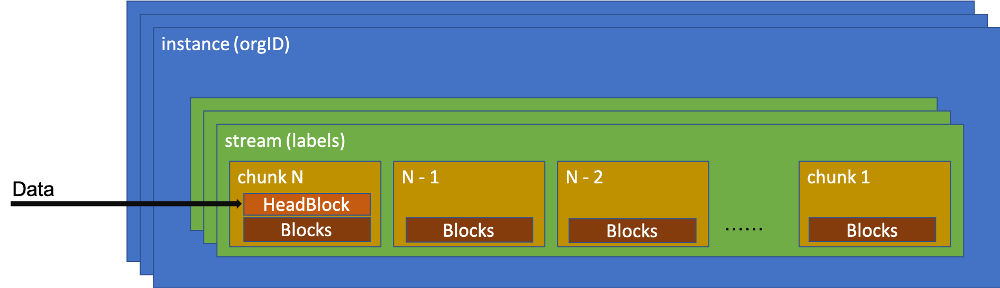
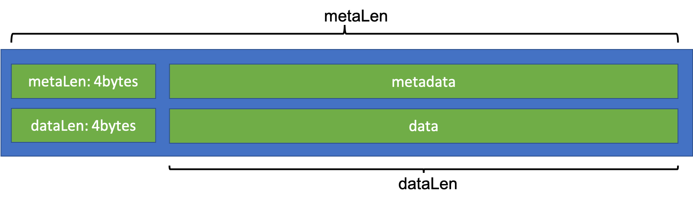

# distributor

在 Loki 中，distributor 通过 HTTP `/loki/api/v1/push` 接口，接收 client 推送的日志数据。

该接口支持 `application/x-protobuf` (preferred) 和 `application/json` 两种格式的数据。

请求时，可以用 HTTP `X-Scope-OrgID` header 标识 orgID 区分不同租户推送的日志；在单一租户的场景中，distributor 会把 orgID 置成默认值 `fake`。

一次请求中，可以批量推送多个 streams，一个 streams 中可以包含多行日志。单次请求的 payload 形如：

```json
{
  "streams": [
    {
      "labels": "{filename=\"/var/log/out1.log\", job=\"varlogs\", level=\"info\"}",
      "entries": [
        {
          "ts": "2020-03-24T12:25:34.59274+08:00",
          "line": "hello"
        }
      ]
    }
  ]
}
```

distributor 收到数据以后，会首先校验 payload 格式：

- 尝试用 logql 词法解析器 parse labels 字段，判断是否合法，labelName、labelValue 是否符合命名规则；
- (根据配置) 检测 line 长度是否超过阈值；
- (根据配置) 针对 orgID，检测推送数据是否被限流。

校验失败的部分被丢弃，并向 client 返回推送失败的消息。只保留校验通过的数据。

distributor 根据 `hash(orgID, labels)` 计算的哈希值。在 hash 过程中，distributor 会确保 labels 中的 labelName 是有序的，所以，即使 distributor 收到两个 streams:

- **labels1** "{key1=val1, key2=val2}"
- **labels2** "{key2=val2, key1=val1}"

distributor 也能确保他们的哈希结果相同。

哈希值被用来从 ingestersRing 中找到 ingester。这一步中，会找到多个 ingester（ingester 会在内存中暂存日志，如果挂了，会导致日志丢失）。所以，distributor 会把数据同时发送给多个 ingester 做 replica。

distributor 通过 gRPC `Push` 方法，把校验通过的数据推送给 ingester。

# ingester

## 内存数据

ingester 收到日志数据以后，会先将数据暂存在内存中，然后定时 (没有看到定量刷的逻辑？) 的将数据 flush 到持久存储中。



日志数据在内存中的数据结构如图所示：

- 最外层，对于每个 orgID，维护了一个 instance 对象。instance 中包含了多个 stream 对象。

- stream 和 labels 一一对应。每个 stream 中，有一个 chunks 队列。ingester 收到数据后，chunks 逐渐增加；ingester flush 数据后，chunks 减少。在 flush 数据后，每个 chuck 会被保存成 ObjectStore 中的一个 object。

- chunk 中，有 HeadBlock 和 Blocks 两种数据结构：

  - 新数据写到 chunk 以后，会先被存在 HeadBlock 中。HeadBlock 中的数据是没有压缩的，新数据来了以后，把日志内容 (line) 和日志时间 (ts) append 到一个 slice 里，HeadBlock 中的存储结构形如： `[]entry{ts, line}` 。

  - HeadBlock 到达指定大小以后 (default 256M)，会先把 HeadBlock 中的数据压缩，再 append 到 Blocks 中，最后清空 HeadBlock 以接收新数据。Loki 支持三种压缩算法：gzip / lz4 / snappy。每一个 Block 中的数据，就已经变成 `[]byte` 了，每一行被序列化成：

    ```
    varint(ts) uvarint(len(line)) line
    ```

  chunk 写满了以后，会把它 append 到 stream 中的 chunks slice 中等待 flush。有两种方式指定 chunk 是否满了：1. 用户可以配置期望的 chunk 大小，chunk_target_size，其单位是计算压缩后的 bytes；2. 如果没有配置 chunk_target_size，那么默认一个 chunk 中最多可以放 10 个 block。

  除了数据以外，每个 chunk 中还会记录元数据信息：

  - 这个 chunk 中日志的开始、结束时间 min(ts)，max(ts)；
  - 压缩算法名称。

有线程负责定时把内存中的 chunks flush 到持久化存储中。哪些 chunks 应该被 flush 呢？挑选的依据是 (shouldFlushChunk):

- Chunk.closed = true （通常是已经写满了，不会有新数据写到这个 chunk 中）
- 长时间没有新数据写入，chunk_idle_period (default: 30m)
- 日志跨度 end - start 超过 max_chunk_age (default: 1h)

## 持久化数据

### ObjectStore

每个 chunk 在持久化到 ObjectStore 时，会经历 a. 生成 key ，b. 序列化 Object 两个过程。

#### Key

Key 的基本格式如下：

```
<orgID>/<FingerPrint>:<start time>:<end time>:<checksum>

// Sprintf("%s/%x:%x:%x:%x", orgID, uint64(Fingerprint), int64(From), int64(Through), int32(Checksum))
```

其中：

- FingerPrint 是由 labels 进过 hash/fnv 哈希生成的；
- start time，end time 是 chunk 中日志的开始、结束时间；
- checksum 是对 Object 序列化后的 binary 的 CRC32 校验值。

针对不同存储的能力差异，Key 的格式会有所变形：

- 使用 base64 对 key 编码；
- 省略 orgID 或 checksum。

#### Object

Object 中分为 metadata 和 data 两段内容。每段开头，都有 4 个 byte 标识后面跟着的数据长度。

如图所示，metaLen 包含了从开头，直到 metadata 结束的全部长度；而 dataLen 不包含自己的 4 个 bytes。



**metadata**

metadata 是 snappy 压缩过的 JSON，记录了这个 chunk 中的元数据信息，包括：

- FingurePrint
- orgID
- metrics (就是 labels)
- From (日志开始时间)
- Through (日志结束时间)
- Encoding (固定值 129，表示这个文件是 cortex 规范中的 LogChunk 类型)

**data**

参考: https://github.com/grafana/loki/tree/master/pkg/chunkenc

```
                  |                 |             |                |
                  | MagicNumber(4b) | version(1b) |  encoding(1b)  |
                  |                 |             |                |
                  --------------------------------------------------
/*offset -> */    |         block-1 bytes         |  checksum (4b) |
                  --------------------------------------------------
                  |         block-2 bytes         |  checksum (4b) |
                  --------------------------------------------------
                  |         block-n bytes         |  checksum (4b) |
                  --------------------------------------------------
                  |         #blocks (uvarint)                      |
                  --------------------------------------------------
/*metasOffset->*/ | #entries(uvarint) | mint, maxt (varint) | offset, len (uvarint) |
                  -------------------------------------------------------------------
                  | #entries(uvarint) | mint, maxt (varint) | offset, len (uvarint) |
                  -------------------------------------------------------------------
                  | #entries(uvarint) | mint, maxt (varint) | offset, len (uvarint) |
                  -------------------------------------------------------------------
                  | #entries(uvarint) | mint, maxt (varint) | offset, len (uvarint) |
                  -------------------------------------------------------------------
                  |                      checksum(from #blocks)                     |
                  -------------------------------------------------------------------
                  | metasOffset - offset to the point with #blocks |
                  --------------------------------------------------
```

其中，

* MagicNumber 是固定值；
* version 记录了 chunk 格式版本，现在是固定值 2；
* encoding，压缩 blocks 数据的压缩算法枚举值；
* "block-N bytes" 是每个 block 压缩序列化后的 `byte[]`，len(varint) 是 block-N bytes 的校验和；
* metasOffset 往后的部分：
  * #entries(uvarint)，block 中包含 entries 数量；
  * mint, maxt，block 中日志数据的开始结束时间；
  * offset，指向对应的每个 block 起始位置；len 是 "block-1 bytes" (不包含 checksum (4b))；

解析 Object 文件时，读文件末尾的 8bits（BE 64int）拿到 metadata 起始位置。

[metasOffset, len(file) - 4b(checksum) - 8b(metasOffset)]，可以读出这个 chunk 中的元数据，从而解析全部日志内容。


### KV-store

KV store 中，保存数据索引。用来解决怎么由用户提交的 logql 表达式，找到 chunkID 的问题。

Loki 中，索引数据被抽象为下面的四元组，`IndexEntry`：

* **TableName** 这条索引数据会保存在哪个 table (或 bucket 中)；
* **HashValue** 编码后的 key 中，可以用来做 `==` 比较的部分；
* **RangeValue** 编码后的 key 中，用来做 `>` (或者 `<` ) 比较的部分；
* **Value** 索引值。针对不同查询条件，Loki 中有几种不同类型的索引。有的索引中，需要查询的值已经被编码在 RangeValue 中，所以对应的 Value 可能是 nil。

Loki 中内置了几种支持的 KV-store 实现。对于不同的 KV-store，IndexEntry 的最终存储格式不尽相同，其中，Cassandra 是可以直接跑 SQL 的，查询语句类似这样：

```sql
SELECT range, value FROM %s WHERE hash = ? AND range >= ? AND range < ?;
```

我的实验条件有限，后面的 Sample 中，数据来自 bbolt 实现。

bbolt 的 bucket 只支持 key/val 两列。所以存储格式被苟且成：

```
bucketName = TableName
key = HashValue + '\000' + RangeValue
val = Value
```


为了方便后面的阅读，先介绍下面几个变量的含义：

* **metricName** log 中是没有 metricName 的。Loki 中复用了大量 cortex 的代码，感觉是为了复用代码方便，强行写了个固定值 `logs`。

* **seriesID** 根据 metricName+labels 计算出的 uuid。计算方法为：把类似这样的 string `metricName{k1="v1", k2="v2"}` 先 sha256 哈希，再 base64 编码后，计算得到的 string。在下面的例子中，seriesID 为 `NfrUWCSw+7mqpss5T+HDG0HyMthXOmi6MZ/OFCekxaA`。

* **bucket.hashKey** `fmt.Sprintf("%s:d%d", orgID, i)`。其中，i 是 `timestampInSeconds / secondsInDay` 得到的天数。

* **shard** sharding key。`binary.BigEndian.Uint32(seriesID) % s.rowShards`，其中，rowShards 是一个可以配置的值 (default 16)。
* **encodeRangeKey** rangeKey 编码函数，会把比如： `encodeRangeKey(byte(7), []byte('a'), []byte('b'), nil)` 变成 `[]byte{61, 0, 62, 0, 7, 0}`


下面，列出几种索引类型，以及他们的生成方式 (因为分割符 '\0' 无法显示，例子中显示的值和真实值略有差异)：

#### metricName -> seriesID

```
HashValue:  fmt.Sprintf("%02d:%s:%s", shard, bucket.hashKey, metricName),
RangeValue: encodeRangeKey(seriesRangeKeyV1, seriesID, nil, nil), // seriesRangeKeyV1=7
```

**Sample**

```
key=05:fake:d18353:logsNfrUWCSw+7mqpss5T+HDG0HyMthXOmi6MZ/OFCekxaA7
val=
```


#### seriesID -> label names

```
HashValue:  string(seriesID),
RangeValue: encodeRangeKey(labelNamesRangeKeyV1, nil, nil, nil),  // labelNamesRangeKeyV1=9
Value:      data,
```

**Sample**

```
key=NfrUWCSw+7mqpss5T+HDG0HyMthXOmi6MZ/OFCekxaA9
val=["filename","job"]
```


#### metricName:labelName -> hash(value):seriesID

```
HashValue:  fmt.Sprintf("%02d:%s:%s:%s", shard, bucket.hashKey, metricName, v.Name),
RangeValue: encodeRangeKey(labelSeriesRangeKeyV1, valueHash, seriesID, nil),
Value:      []byte(v.Value),
// labelSeriesRangeKeyV1=8
// valueHash := sha256bytes(v.Value)
```

**Sample**

```
key=05:fake:d18353:logs:filenameUVdaivglACXbR77ysfL5HYQmLLbpvlGJ1jBHJtVVm1YNfrUWCSw+7mqpss5T+HDG0HyMthXOmi6MZ/OFCekxaA8
val=/var/log/out1.log
```


#### seriesID -> chunkID

````
HashValue:  bucket.hashKey + ":" + string(seriesID),
RangeValue: encodeRangeKey(chunkTimeRangeKeyV3, encodedThroughBytes, nil, []byte(chunkID)),
// chunkTimeRangeKeyV3=3
// encodedThroughBytes := encodeTime(bucket.through)
````

**Sample**

```
key=fake:d18353:NfrUWCSw+7mqpss5T+HDG0HyMthXOmi6MZ/OFCekxaA01b512cdfake/47016efa3263019d:17134beaebb:17134beaecd:c46b77bf3
val=
```

例子中，chunkID 为 `fake/47016efa3263019d:17134beaebb:17134beaecd:c46b77bf`。


# Risks

存储一挂，ingress 全挂

往 ObjectStore 写数据的时候，没有 retry count，所以一旦写失败，就加回队列里重试。

如果存储异常，那么队列越来越长，直到 OOM。

```go
// If we're exiting & we failed to flush, put the failed operation
// back in the queue at a later point.
if op.immediate && err != nil {
  op.from = op.from.Add(flushBackoff)
  i.flushQueues[j].Enqueue(op)
}
```

------

在 Loki 中，虽然架构图中没有提到，但是需要有一个中心化的 cache 做些事情，比如写 KV-store 时，会用 cache 对 IndexEntry dedupe。单机环境中，用 in-memory 的实现可以搞定，但是在生产环境部署时，估计单机 dedupe 就没啥用了。这时候就需要个 redis 或者 memcache：

https://github.com/grafana/loki/blob/master/docs/configuration/README.md#cache_config


# Reference

[1] https://carlmastrangelo.com/blog/lets-make-a-varint
